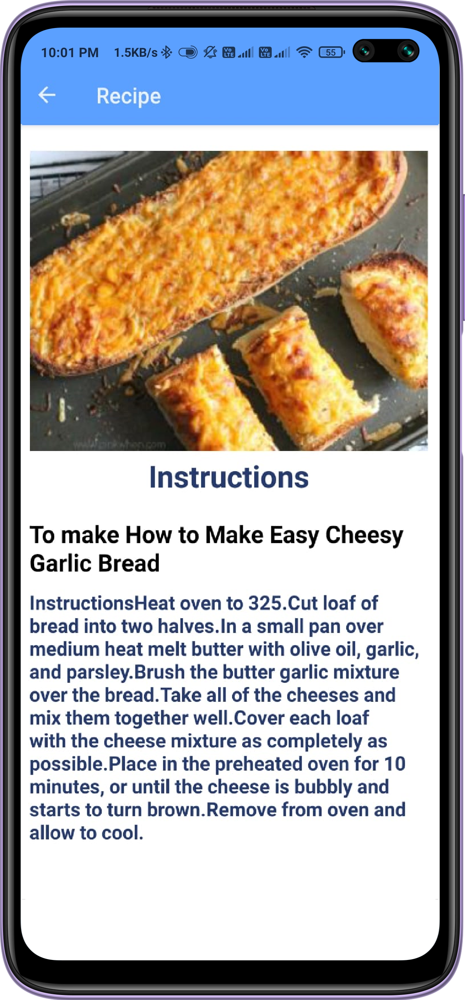
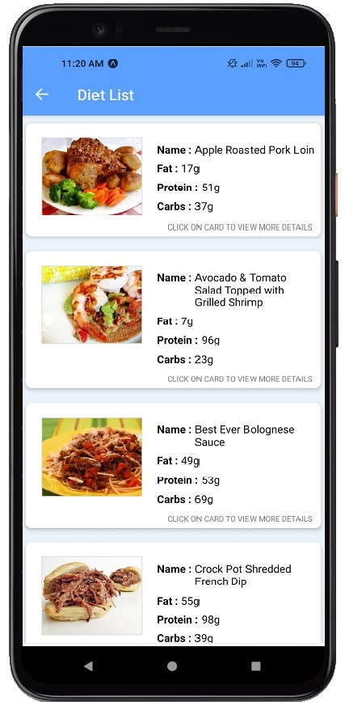

# Healthical

### Healthical is a healthcare application used to help users to find appropriate resources for their physical well-being. :iphone:
### It is a one-stop shop for all the healthcare needs of the user. Weather the user feels out of shape and needs some basic lifestyle changes with the help of exercise and diet, or wether she/he feels under the weather and wants to find the best way of approaching the professionals, Healthical is there for you. :star2:

App Screens
-------
| Splash Screen        | SignUp Page           | 
| ------------- | -----:|
|      | | 
------
| Login Page        | Home Screen          | 
| ------------- | -----:|
|      | |

Features
------
### BMI Calculator
* Easy calculation of BMI using the height and weight to be entered by the user
* Recommended diets and videos suggested by the app based on the BMI calculated on the given input

### Diet Plan
------

  

* This is point 1
* this is point 2
      

### Chatbot
* Generic diagnosis provided by chatbot based on the symptoms entered by the user
* Suggestions to consult the appropriate professional help
* Contact number of certified health professionals 

------
